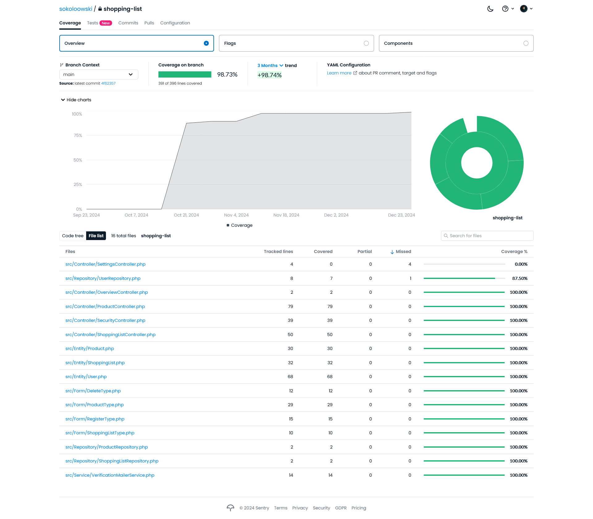

\newpage

# Wykorzystany framework

W projekcie wykorzystano framework Symfony, służący do tworzenia aplikacji w języku PHP. Symfony jest jednym z najpopularniejszych frameworków PHP, który pozwala na tworzenie aplikacji webowych, API, mikroserwisów, a także aplikacji konsolowych. Symfony jest frameworkiem open-source, co oznacza, że jest dostępny za darmo i każdy może go używać, modyfikować i rozwijać.

# Testy w Symfony

Testy pisane są w PHP z wykorzystaniem biblioteki PHPUnit. Według [dokumentacji](https://symfony.com/doc/current/testing.html#types-of-tests), Symfony oferuje następujące typy testów:

- jednostkowe - wykonywane w obrębie pojedynczej klasy,
- integracyjne - wykonywane w obrębie kilku klas, ale bez zapytań HTTP,
- aplikacji - wykonywane w obrębie kilku klas, razem z zapytaniami HTTP (również symulowanymi).

Inaczej wygląda to jednak podczas tworzenia testów, gdyż narzędzie CLI dostarczone przez Symfony pozwala na wybór jednego z pięciu typów testów:

```
sokoloowski@legion:~/shopping-list$ symfony console make:test                                         

 Which test type would you like?:
  [TestCase       ] basic PHPUnit tests
  [KernelTestCase ] basic tests that have access to Symfony services
  [WebTestCase    ] to run browser-like scenarios
  [ApiTestCase    ] to run API-oriented scenarios
  [PantherTestCase] to run e2e scenarios, using a real-browser and server
 > 
```

W projekcie wykorzystano testy jednostkowe (`TestCase`) oraz testy aplikacji (`WebTestCase`). Ze względu na specyfikę opracowanego kodu, frameworku Symfony oraz narzędzia PHPUnit, testy integracyjne zostały wykonane z wykorzystaniem klasy `TestCase` - nie było potrzeby uruchamiania jądra aplikacji. `ApiTestCase` oraz `PantherTestCase` nie zostały wykorzystane w projekcie.

# Omówienie testów

Do monitorowania pokrycia kodu testami wykorzystano narzędzie [Codecov](https://about.codecov.io/). W projekcie wykorzystano automatyzację testów za pomocą GitHub Actions. Wszystkie testy są uruchamiane automatycznie po każdym wypchnięciu do repozytorium, a wyniki przekazywane do Codecov.



## Testy jednostkowe

### `Entity\ProductTest`

#### `testWhenNameIsSet_ThenCorrectNameIsGet`

Weryfikacja, czy ustawienie nazwy produktu jest poprawne.

#### `testWhenQuantityIsSet_ThenCorrectQuantityIsGet`

Weryfikacja, czy ustawienie ilości produktu jest poprawne.

#### `testWhenProductIsCreated_ThenRealisationIsFalse`

Weryfikacja, czy po utworzeniu produktu nie jest zrealizowany.

#### `testWhenRealisationIsFalse_ThenToggleSetTrue`

Weryfikacja, czy produkt niezrealizowany jest przełączany na zrealizowany.

#### `testWhenRealisationIsSet_ThenCorrectRealisationIsGet`

Weryfikacja, czy ustawienie zrealizowania produktu jest poprawne.

#### `testWhenRealisationIsTrue_ThenToggleSetFalse`

Weryfikacja, czy produkt zrealizowany jest przełączany na niezrealizowany.

### `Entity\ShoppingListTest`

#### `testWhenShoppingListIsCreated_ThenNameIsNotNull`

Weryfikacja, czy po utworzeniu listy zakupów nazwa listy nie jest `null`.

#### `testWhenShoppingListIsCreated_ThenNameIsNotEmpty`

Weryfikacja, czy po utworzeniu listy zakupów nazwa listy nie jest pusta.

#### `testWhenNameIsSet_ThenCorrectNameIsGet`

Weryfikacja, czy ustawienie nazwy listy zakupów jest poprawne.

#### `testWhenPurchaseDateIsSet_ThenCorrectDateIsGet`

Weryfikacja, czy ustawienie daty zakupu jest poprawne.

### `Entity\UserTest`

#### `testWhenUserVerifiedAtIsNull_ThenUserVerifiedIsFalse`

Weryfikacja, czy nowo utworzony obiekt klasy `Entity\User` nie jest zweryfikowany.

#### `testWhenUserVerifiedAtIsNull_ThenUserVerificationDateIsNull`

Weryfikacja, czy nowo utworzony obiekt klasy `Entity\User` ma właściwość `verifiedAt` ustawioną na `null` (nie został zweryfikowany).

#### `testWhenUserIsRegistered_ThenRegisteredAtIsAfterCreation`

Weryfikacja, czy data rejestracji użytkownika jest późniejsza niż data wywołania konstruktora obiektu klasy `Entity\User`.

#### `testWhenUserIsRegistered_ThenRegisteredAtIsBeforeNow`

Weryfikacja, czy data rejestracji użytkownika nie jest w przyszłości.

#### `testWhenUserIsRegistered_ThenVerificationCodeIsNotEmpty`

Weryfikacja, czy kod weryfikacyjny użytkownika nie jest pusty (czy został wygenerowany).

#### `testWhenUserIsRegistered_ThenVerificationCodeHasCertainLength`

Werfikacja, czy kod weryfikacyjny użytkownika ma określoną długość.

#### `testWhenWrongVerificationCodeUsed_ThenHttpExceptionIsThrown`

Weryfikacja, czy próba weryfikacji użytkownika z użyciem błędnego kodu weryfikacyjnego kończy się wyjątkiem.

#### `testWhenCorrectVerificationCodeUsed_ThenVerificationDateIsSet`

Weryfikacja, czy po poprawnej weryfikacji użytkownika data weryfikacji jest ustawiona.

#### `testWhenCorrectVerificationCodeUsed_ThenVerificationDateIsAfterVerification`

Weryfikacja, czy data weryfikacji użytkownika jest późniejsza niż data wywołania konstruktora obiektu klasy `Entity\User`.

#### `testWhenCorrectVerificationCodeUsed_ThenVerificationDateIsBeforeNow`

Weryfikacja, czy data weryfikacji nie jest w przyszłości.

#### `testWhenUserIsVerified_ThenVerificationIsAfterRegistration`

Weryfikacja, czy data weryfikacji jest późniejsza niż data rejestracji.

#### `testWhenUserLogIn_ThenLastLogInDateIsUpdated`

Weryfikacja, czy po zalogowaniu użytkownika data ostatniego logowania jest aktualizowana.

#### `testWhenUserRegister_ThenLastLogInDateIsNull`

Weryfikacja, czy po zarejestrowaniu użytkownika data ostatniego logowania jest ustawiona na `null` (nigdy nie zalogowany).

#### `testWhenUserLogIn_ThenLastLogInDateIsNotNull`

Weryfikacja, czy po zalogowaniu użytkownika data ostatniego logowania nie jest `null`.

#### `testWhenUsernameIsSet_ThenCorrectUsernameIsGet`

Weryfikacja, czy ustawienie nazwy użytkownika jest poprawne.

#### `testWhenEmailIsSet_ThenCorrectEmailIsGet`

Weryfikacja, czy ustawienie adresu e-mail użytkownika jest poprawne.

#### `testWhenRolesAreRemoved_ThenUserRoleIsReturnedAnyway`

Weryfikacja, czy po usunięciu ról użytkownika, użytkownik nadal ma przypisaną rolę `ROLE_USER`.

#### `testWhenIdentifierIsGet_ThenIdentifierEqualsEmail`

Weryfikacja, czy identyfikator użytkownika jest równy adresowi e-mail.

#### `testWhenPasswordIsSet_ThenCorrectPasswordIsGet`

Weryfikacja, czy ustawienie hasła użytkownika jest poprawne.

## Testy integracyjne

### `Entity\ProductTest`

#### `testWhenProductIsCreated_ThenShoppingListIsAssigned`

Weryfikacja, czy po utworzeniu produktu przypisana jest lista zakupów.

#### `testWhenUnitIsSet_ThenCorrectUnitIsGet`

Weryfikacja, czy ustawienie jednostki produktu jest poprawne.

### `Entity\ShoppingListTest`

#### `testWhenShoppingListIsCreated_ThenOwnerIsAssigned`

Weryfikacja, czy po utworzeniu listy zakupów właścicielem listy jest użytkownik.

#### `testWhenProductIsAddedToShoppingList_ThenProductIsAddedToItems`

Weryfikacja, czy dodanie produktu do listy zakupów powoduje dodanie produktu do kolekcji produktów.

#### `testWhenProductIsAddedToShoppingList_ThenProductShoppingListWillBeSet`

Weryfikacja, czy dodanie produktu do listy zakupów powoduje przypisanie produktowi listy zakupów.

#### `testWhenProductIsRemovedFromList_ThenProductRemovesParentList`

Weryfikacja, czy po usunięciu produktu z listy zakupów produkt nie jest już przypisany do listy.

### `Entity\UserTest`

#### `testWhenUserCreatesNewShoppingList_ThenShoppingListIsAddedToUser`

Weryfikacja, czy dodanie nowej listy zakupów do użytkownika powoduje dodanie listy do kolekcji list zakupów użytkownika.

#### `testWhenUserCreatesNewShoppingList_ThenShoppingListOwnerWillBeSet`

Weryfikacja, czy dodanie nowej listy zakupów do użytkownika powoduje ustawienie właściciela listy na użytkownika.

#### `testWhenShoppingListIsRemovedFromUser_ThenShoppingListRemovesParentList`

Weryfikacja, czy po usunięciu listy zakupów z użytkownika lista nie jest już przypisana do użytkownika.

### `Service\VerificationMailerServiceTest`

#### `testWhenMailerInterfaceThrowsException_ThenServiceThrowsExceptionToo`

Weryfikacja, czy w przypadku błędu w interfejsie mailera, serwis rzuci wyjątek.

## Testy aplikacji

### `Controller\OverviewController\OverviewTest`

#### `testWhenUserWantsToSeeList_ThenUserHasToLogInFirst`

Weryfikacja, czy użytkownik musi być zalogowany, aby zobaczyć listę zakupów.

#### `testWhenAuthorizedUserWantsToSeeList_ThenOverviewPageExists`

Weryfikacja, czy zalogowany użytkownik może zobaczyć stronę z listą zakupów.

#### `testWhenAuthorizedUserWantsToSeeList_ThenAllListsAreShown`

Weryfikacja, czy zalogowany użytkownik widzi wszystkie listy zakupów.

#### `testWhenAuthorizedUserWantsToModifyAccount_ThenSettingsLinkIsShown`

Weryfikacja, czy zalogowany użytkownik widzi link do ustawień konta.

#### `testWhenAuthorizedUserWantsToSeeList_ThenOverviewLinkIsShown`

Weryfikacja, czy zalogowany użytkownik widzi link do listy zakupów.

#### `testWhenAuthorizedUserClicksOnLink_ThenLinkIsNotDummy`

Weryfikacja, czy linki w menu są aktywne.

### `Controller\ProductController\CreateTest`

#### `testWhenUserWantsToCreateProduct_ThenUserHasToBeAuthenticated`

Weryfikacja, czy użytkownik musi być zalogowany, aby dodać produkt.

#### `testWhenAuthenticatedUserWantsToCreateProduct_ThenResponseIsSuccessful`

Weryfikacja, czy zalogowany użytkownik może dodać produkt.

#### `testWhenAuthenticatedUserWantsToCreateProduct_ThenResponseContainsHeading`

Weryfikacja, czy odpowiedź zawiera nagłówek.

#### `testWhenAuthenticatedUserWantsToCreateProduct_ThenResponseContainsForm`

Weryfikacja, czy odpowiedź zawiera formularz.

#### `testWhenAuthenticatedUserWantsToCreateProduct_ThenAutocompleteButtonIsShown`

Weryfikacja, czy przycisk autouzupełniania jest widoczny.

#### `testWhenAuthenticatedUserWantsToCreateProduct_ThenNameInputIsShown`

Weryfikacja, czy pole nazwy produktu jest widoczne.

#### `testWhenAuthenticatedUserWantsToCreateProduct_ThenQuantityInputIsShown`

Weryfikacja, czy pole ilości produktu jest widoczne.

#### `testWhenAuthenticatedUserWantsToCreateProduct_ThenUnitSelectIsShown`

Weryfikacja, czy pole jednostki produktu jest widoczne.

#### `testWhenAuthenticatedUserWantsToCreateProduct_ThenListSelectIsShown`

Weryfikacja, czy pole listy zakupów jest widoczne.

#### `testWhenAuthenticatedUserWantsToCreateProduct_ThenSubmitButtonIsShown`

Weryfikacja, czy przycisk zatwierdzenia jest widoczny.

#### `testWhenAuthenticatedUserWantsToCreateProduct_ThenCancelButtonIsShown`

Weryfikacja, czy przycisk anulowania jest widoczny.

#### `testWhenAuthenticatedUserWantsToCreateProductOnOthersList_ThenForbiddenErrorIsThrown`

Weryfikacja, czy użytkownik nie może dodać produktu do listy zakupów innego użytkownika.

#### `testWhenAuthenticatedUserSubmitsForm_ThenProductIsCreated`

Weryfikacja, czy po zatwierdzeniu formularza produkt zostaje dodany.

#### `testWhenAuthorizedUserClicksOnLink_ThenLinkIsNotDummy`

Weryfikacja, czy linki w menu są aktywne.

### `Controller\ProductController\DeleteTest`

#### `testWhenUserWantsToDeleteProduct_ThenUserHasToBeAuthenticated`

Weryfikacja, czy użytkownik musi być zalogowany, aby usunąć produkt.

#### `testWhenAuthenticatedUserWantsToDeleteProduct_ThenResponseIsSuccessful`

Weryfikacja, czy zalogowany użytkownik może usunąć produkt.

#### `testWhenAuthenticatedUserWantsToDeleteProduct_ThenResponseContainsHeading`

Weryfikacja, czy odpowiedź zawiera nagłówek.

#### `testWhenAuthenticatedUserWantsToDeleteProduct_ThenResponseContainsForm`

Weryfikacja, czy odpowiedź zawiera formularz.

#### `testWhenAuthenticatedUserWantsToDeleteProduct_ThenSubmitButtonIsShown`

Weryfikacja, czy przycisk zatwierdzenia jest widoczny.

#### `testWhenAuthenticatedUserWantsToDeleteProduct_ThenCancelButtonIsShown`

Weryfikacja, czy przycisk anulowania jest widoczny.

#### `testWhenAuthenticatedUserWantsToDeleteProductOnOthersList_ThenForbiddenErrorIsThrown`

Weryfikacja, czy użytkownik nie może usunąć produktu z listy zakupów innego użytkownika.

#### `testWhenAuthenticatedUserSubmitsForm_ThenProductIsDeleted`

Weryfikacja, czy po zatwierdzeniu formularza produkt zostaje usunięty.

#### `testWhenAuthorizedUserClicksOnLink_ThenLinkIsNotDummy`

Weryfikacja, czy linki w menu są aktywne.

### `Controller\ProductController\ToggleTest`

#### `testWhenUserWantsToToggleProduct_ThenUserHasToBeAuthenticated`

Weryfikacja, czy użytkownik musi być zalogowany, aby przełączyć produkt.

#### `testWhenAuthenticatedUserWantsToToggleProduct_ThenResponseIsRedirectingBackToList`

Weryfikacja, czy zalogowany użytkownik po przełączeniu produktu jest przekierowany z powrotem na listę zakupów.

#### `testWhenAuthenticatedUserWantsToToggleProductOnOthersList_ThenForbiddenErrorIsThrown`

Weryfikacja, czy użytkownik nie może przełączyć produktu na liście zakupów innego użytkownika.

#### `testWhenAuthenticatedUserSubmitsForm_ThenProductIsToggled`

Weryfikacja, czy po zatwierdzeniu formularza produkt zostaje przełączony.

### `Controller\ProductController\UpdateTest`

#### `testWhenUserWantsToEditProduct_ThenUserHasToBeAuthenticated`

Werfikacja, czy użytkownik musi być zalogowany, aby edytować produkt.

#### `testWhenAuthenticatedUserWantsToCreateProduct_ThenResponseIsSuccessful`

Weryfikacja, czy zalogowany użytkownik może edytować produkt.

#### `testWhenAuthenticatedUserWantsToCreateProduct_ThenResponseContainsHeading`

Weryfikacja, czy odpowiedź zawiera nagłówek.

#### `testWhenAuthenticatedUserWantsToCreateProduct_ThenResponseContainsForm`

Weryfikacja, czy odpowiedź zawiera formularz.

#### `testWhenAuthenticatedUserWantsToCreateProduct_ThenNameInputIsShown`

Weryfikacja, czy pole nazwy produktu jest widoczne.

#### `testWhenAuthenticatedUserWantsToCreateProduct_ThenQuantityInputIsShown`

Weryfikacja, czy pole ilości produktu jest widoczne.

#### `testWhenAuthenticatedUserWantsToCreateProduct_ThenUnitSelectIsShown`

Weryfikacja, czy pole jednostki produktu jest widoczne.

#### `testWhenAuthenticatedUserWantsToCreateProduct_ThenListSelectIsShown`

Weryfikacja, czy pole listy zakupów jest widoczne.

#### `testWhenAuthenticatedUserWantsToCreateProduct_ThenSubmitButtonIsShown`

Weryfikacja, czy przycisk zatwierdzenia jest widoczny.

#### `testWhenAuthenticatedUserWantsToCreateProduct_ThenCancelButtonIsShown`

Weryfikacja, czy przycisk anulowania jest widoczny.

#### `testWhenAuthenticatedUserWantsToEditProductOnOthersList_ThenForbiddenErrorIsThrown`

Weryfikacja, czy użytkownik nie może edytować produktu na liście zakupów innego użytkownika.

#### `testWhenAuthenticatedUserSubmitsForm_ThenProductIsUpdated`

Weryfikacja, czy po zatwierdzeniu formularza produkt zostaje zaktualizowany.

#### `testWhenAuthorizedUserClicksOnLink_ThenLinkIsNotDummy`

Weryfikacja, czy linki w menu są aktywne.

### `Controller\SecurityController\LoginTest`

#### `testWhenClientWantsToLogIn_ThenLoginPageExists`

Weryfikacja, czy strona logowania istnieje.

#### `testWhenOnLoginPage_ThenEmailInputIsShown`

Weryfikacja, czy pole adresu e-mail jest widoczne.

#### `testWhenOnLoginPage_ThenPasswordInputIsShown`

Weryfikacja, czy pole hasła jest widoczne.

#### `testWhenOnLoginPage_ThenSubmitButtonIsShown`

Weryfikacja, czy przycisk zatwierdzenia jest widoczny.

#### `testWhenOnLoginPage_ThenRegisterButtonIsShown`

Weryfikacja, czy przycisk rejestracji jest widoczny.

#### `testWhenUserTriesToUseWrongPassword_ThenMessageIsShown`

Weryfikacja, czy po próbie zalogowania się z błędnym hasłem wyświetlany jest komunikat.

#### `testWhenUserTriesToUseCorrectPassword_ThenUserIsRedirectedToHome`

Weryfikacja, czy po próbie zalogowania się z poprawnym hasłem użytkownik jest przekierowany na stronę główną.

#### `testWhenUserLogsOut_ThenUserIsRedirectedToHome`

Weryfikacja, czy po wylogowaniu użytkownik jest przekierowany na stronę główną.

#### `testWhenAuthorizedUserClicksOnLink_ThenLinkIsNotDummy`

Weryfikacja, czy linki w menu są aktywne.

### `Controller\SecurityController\RegisterTest`

#### `testWhenClientWantsToRegister_ThenRegisterPageExists`

Weryfikacja, czy strona rejestracji istnieje.

#### `testWhenOnRegisterPage_ThenEmailInputIsShown`

Weryfikacja, czy pole adresu e-mail jest widoczne.

#### `testWhenOnRegisterPage_ThenPasswordInputIsShown`

Weryfikacja, czy pole hasła jest widoczne.

#### `testWhenOnRegisterPage_ThenSubmitButtonIsShown`

Weryfikacja, czy przycisk zatwierdzenia jest widoczny.

#### `testWhenOnRegisterPage_ThenLoginButtonIsShown`

Weryfikacja, czy przycisk logowania jest widoczny.

#### `testWhenUserTriesToSignUp_ThenPasswordMustBeConfirmed`

Weryfikacja, czy użytkownik musi potwierdzić hasło.

#### `testWhenUserSignsUp_ThenAccountIsCreated`

Weryfikacja, czy po rejestracji użytkownik ma konto.

#### `testWhenUserSignsUp_ThenPasswordIsHashed`

Weryfikacja, czy hasło użytkownika jest zahaszowane.

#### `testWhenUserSignsUp_ThenVerificationMailIsSent`

Weryfikacja, czy po rejestracji wysłany jest e-mail weryfikacyjny.

#### `testWhenUserSignsUpAndErrorIsThrown_ThenUserIsRemoved`

Weryfikacja, czy po błędzie podczas rejestracji użytkownik jest usuwany.

#### `testWhenAuthorizedUserClicksOnLink_ThenLinkIsNotDummy`

Weryfikacja, czy linki w menu są aktywne.

### `Controller\SecurityController\VerifyTest`

#### `testWhenUserClicksVerificationLink_ThenUserIsVerified`

Weryfikacja, czy po kliknięciu w link weryfikacyjny użytkownik jest zweryfikowany.

#### `testWhenUserClicksOldVerificationLink_ThenUserIsNotVerified`

Weryfikacja, czy po kliknięciu w stary link weryfikacyjny użytkownik nie jest zweryfikowany.

### `Controller\ShoppingListController\CreateTest`

#### `testWhenUserWantsToCreateList_ThenUserHasToBeAuthenticated`

Weryfikacja, czy użytkownik musi być zalogowany, aby dodać listę zakupów.

#### `testWhenAuthenticatedUserWantsToCreateList_ThenResponseIsSuccessful`

Weryfikacja, czy zalogowany użytkownik może dodać listę zakupów.

#### `testWhenAuthenticatedUserWantsToCreateList_ThenResponseContainsHeading`

Weryfikacja, czy odpowiedź zawiera nagłówek.

#### `testWhenAuthenticatedUserWantsToCreateList_ThenResponseContainsForm`

Weryfikacja, czy odpowiedź zawiera formularz.

#### `testWhenAuthenticatedUserWantsToCreateList_ThenNameInputIsShown`

Weryfikacja, czy pole nazwy listy zakupów jest widoczne.

#### `testWhenAuthenticatedUserWantsToCreateList_ThenPurchaseDateInputIsShown`

Weryfikacja, czy pole daty zakupu jest widoczne.

#### `testWhenAuthenticatedUserWantsToCreateList_ThenSubmitButtonIsShown`

Weryfikacja, czy przycisk zatwierdzenia jest widoczny.

#### `testWhenAuthenticatedUserWantsToCreateList_ThenCancelButtonIsShown`

Weryfikacja, czy przycisk anulowania jest widoczny.

#### `testWhenAuthenticatedUserSubmitsForm_ThenListIsCreated`

Weryfikacja, czy po zatwierdzeniu formularza lista zakupów zostaje dodana.

#### `testWhenAuthorizedUserClicksOnLink_ThenLinkIsNotDummy`

Weryfikacja, czy linki w menu są aktywne.

### `Controller\ShoppingListController\DeleteTest`

#### `testWhenUserWantsToDeleteList_ThenUserHasToBeAuthenticated`

Weryfikacja, czy użytkownik musi być zalogowany, aby usunąć listę zakupów.

#### `testWhenAuthenticatedUserWantsToDeleteList_ThenResponseIsSuccessful`

Weryfikacja, czy zalogowany użytkownik może usunąć listę zakupów.

#### `testWhenAuthenticatedUserWantsToDeleteList_ThenResponseContainsHeading`

Weryfikacja, czy odpowiedź zawiera nagłówek.

#### `testWhenAuthenticatedUserWantsToDeleteList_ThenResponseContainsForm`

Weryfikacja, czy odpowiedź zawiera formularz.

#### `testWhenAuthenticatedUserWantsToDeleteList_ThenSubmitButtonIsShown`

Weryfikacja, czy przycisk zatwierdzenia jest widoczny.

#### `testWhenAuthenticatedUserWantsToDeleteList_ThenCancelButtonIsShown`

Weryfikacja, czy przycisk anulowania jest widoczny.

#### `testWhenAuthenticatedUserWantsToDeleteListOnOthersList_ThenForbiddenErrorIsThrown`

Weryfikacja, czy użytkownik nie może usunąć listy zakupów innego użytkownika.

#### `testWhenAuthenticatedUserSubmitsForm_ThenListIsDeleted`

Weryfikacja, czy po zatwierdzeniu formularza lista zakupów zostaje usunięta.

#### `testWhenAuthorizedUserClicksOnLink_ThenLinkIsNotDummy`

Weryfikacja, czy linki w menu są aktywne.

### `Controller\ShoppingListController\ReadTest`

#### `testWhenUserWantsToDisplayList_ThenUserHasToBeAuthenticated`

Weryfikacja, czy użytkownik musi być zalogowany, aby zobaczyć listę zakupów.

#### `testWhenAuthenticatedUserWantsToDisplayProductsOnOthersList_ThenForbiddenErrorIsThrown`

Weryfikacja, czy użytkownik nie może zobaczyć produktów na liście zakupów innego użytkownika.

#### `testWhenAuthenticatedUserWantsToDisplayList_ThenResponseIsSuccessful`

Weryfikacja, czy zalogowany użytkownik może zobaczyć listę zakupów.

#### `testWhenAuthenticatedUserWantsToDisplayList_ThenCartButtonIsShown`

Weryfikacja, czy przycisk koszyka jest widoczny.

#### `testWhenAuthenticatedUserWantsToDisplayList_ThenCollectButtonIsShown`

Weryfikacja, czy przycisk zbierania jest widoczny.

#### `testWhenAuthenticatedUserWantsToDisplayList_ThenEditButtonIsShown`

Weryfikacja, czy przycisk edycji jest widoczny.

#### `testWhenAuthenticatedUserWantsToDisplayList_ThenRemoveButtonIsShown`

Weryfikacja, czy przycisk usuwania jest widoczny.

#### `testWhenAuthenticatedUserWantsToDisplayList_ThenListEditButtonIsShown`

Weryfikacja, czy przycisk edycji listy jest widoczny.

#### `testWhenAuthenticatedUserWantsToDisplayList_ThenListDeleteButtonIsShown`

Weryfikacja, czy przycisk usuwania listy jest widoczny.

#### `testWhenAuthorizedUserClicksOnLink_ThenLinkIsNotDummy`

Weryfikacja, czy linki w menu są aktywne.

### `Controller\ShoppingListController\UpdateTest`

#### `testWhenUserWantsToEditList_ThenUserHasToBeAuthenticated`

Weryfikacja, czy użytkownik musi być zalogowany, aby edytować listę zakupów.

#### `testWhenAuthenticatedUserWantsToEditList_ThenResponseIsSuccessful`

Weryfikacja, czy zalogowany użytkownik może edytować listę zakupów.

#### `testWhenAuthenticatedUserWantsToEditList_ThenResponseContainsHeading`

Weryfikacja, czy odpowiedź zawiera nagłówek.

#### `testWhenAuthenticatedUserWantsToEditList_ThenResponseContainsForm`

Weryfikacja, czy odpowiedź zawiera formularz.

#### `testWhenAuthenticatedUserWantsToEditList_ThenNameInputIsShown`

Weryfikacja, czy pole nazwy listy zakupów jest widoczne.

#### `testWhenAuthenticatedUserWantsToEditList_ThenPurchaseDateInputIsShown`

Weryfikacja, czy pole daty zakupu jest widoczne.

#### `testWhenAuthenticatedUserWantsToEditList_ThenSubmitButtonIsShown`

Weryfikacja, czy przycisk zatwierdzenia jest widoczny.

#### `testWhenAuthenticatedUserWantsToEditList_ThenCancelButtonIsShown`

Weryfikacja, czy przycisk anulowania jest widoczny.

#### `testWhenAuthenticatedUserWantsToUpdateOthersList_ThenForbiddenErrorIsThrown`

Weryfikacja, czy użytkownik nie może edytować listy zakupów innego użytkownika.

#### `testWhenAuthenticatedUserSubmitsForm_ThenListIsUpdated`

Weryfikacja, czy po zatwierdzeniu formularza lista zakupów zostaje zaktualizowana.

#### `testWhenAuthorizedUserClicksOnLink_ThenLinkIsNotDummy`

Weryfikacja, czy linki w menu są aktywne.

# Podsumowanie

Testy jednostkowe, integracyjne oraz aplikacji zostały napisane zgodnie z zasadami TDD. Wszystkie testy przechodzą pozytywnie, co oznacza, że kod jest poprawny. Testy jednostkowe sprawdzają poprawność działania poszczególnych klas, testy integracyjne sprawdzają poprawność współpracy klas, a testy aplikacji sprawdzają poprawność działania aplikacji jako całości. Testy są automatycznie uruchamiane po każdym wypchnięciu do repozytorium, a wyniki są przekazywane do Codecov. Dzięki temu można śledzić pokrycie kodu testami oraz monitorować jakość kodu.
